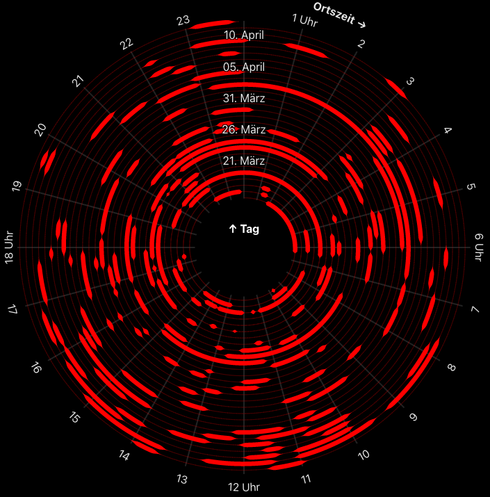

#  sirens

> a DER SPIEGEL visualization




## Original article

[Leben im Sirenenlärm](https://www.spiegel.de/ausland/krieg-in-der-ukraine-leben-im-sirenenlaerm-a-0fa5dbbd-6639-4375-a990-c50cd577813d)


## Data source

2022 data from the »Air Alert Ukraine« Telegram channel, processed by [Volodymyr Agafonkin](https://github.com/mourner)


## Run locally

```
git clone https://github.com/spiegelgraphics/sirens.git
cd sirens
npm install
npm run dev
```


## Built by

the [DER SPIEGEL](https://www.spiegel.de) graphics desk, 2023.

The application was slightly changed compared to its original to be able to run it outside of a dedicated CMS.


## License

Apache License Version 2.0